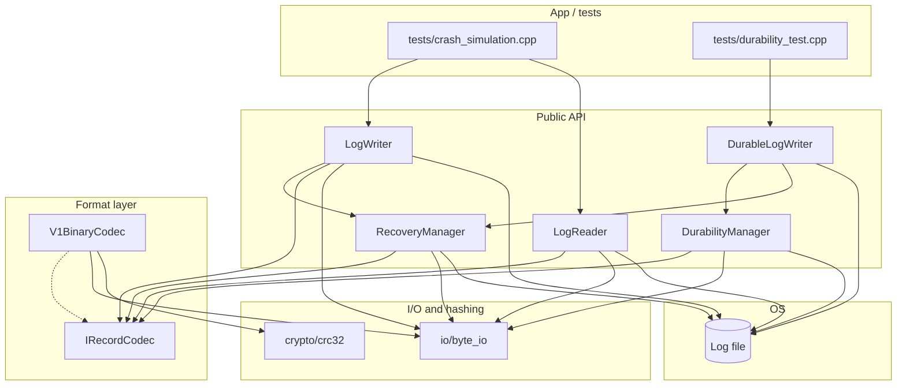
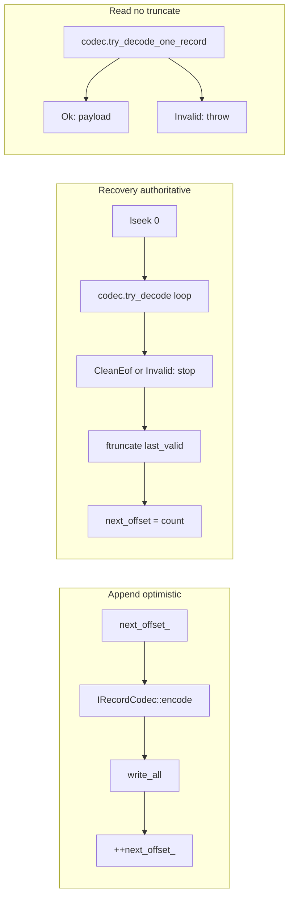
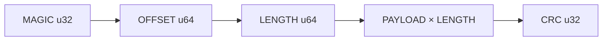
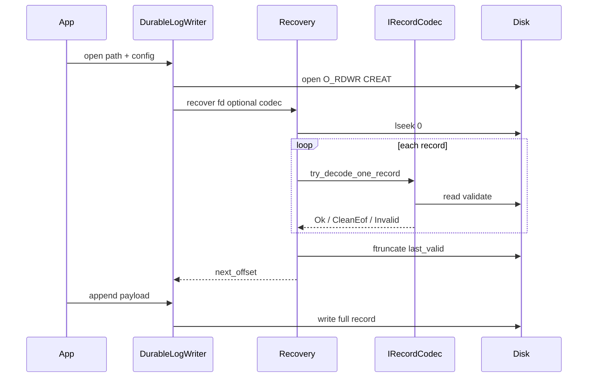

# Architecture (study guide)

Mermaid diagrams below render in GitHub, VS Code Markdown preview, and many other viewers.

## Suggested reading order

1. `include/log_storage/format/irecord_codec.hpp` — pluggable framing contract  
2. `include/log_storage/format/v1_constants.hpp` + `format/v1_binary_codec.hpp` — default on-disk layout  
3. `src/log_storage/recovery/recovery_manager.cpp` — scan, stop at first invalid, `ftruncate`  
4. `src/log_storage/writer/log_writer.cpp` — open → recover → append  
5. `src/log_storage/durability/durability_manager.cpp` + `writer/durable_log_writer.cpp` — Week 2 SYNC/ASYNC  
6. `src/log_storage/reader/log_reader.cpp` — sequential read  

See **`docs/EXTENSION.md`** for adding a new codec or backend.

## Components and dependencies

## Append vs recovery vs read

## On-disk record (V1, strict byte order, little-endian scalars)

## Open DurableLogWriter: recovery then durability threads

