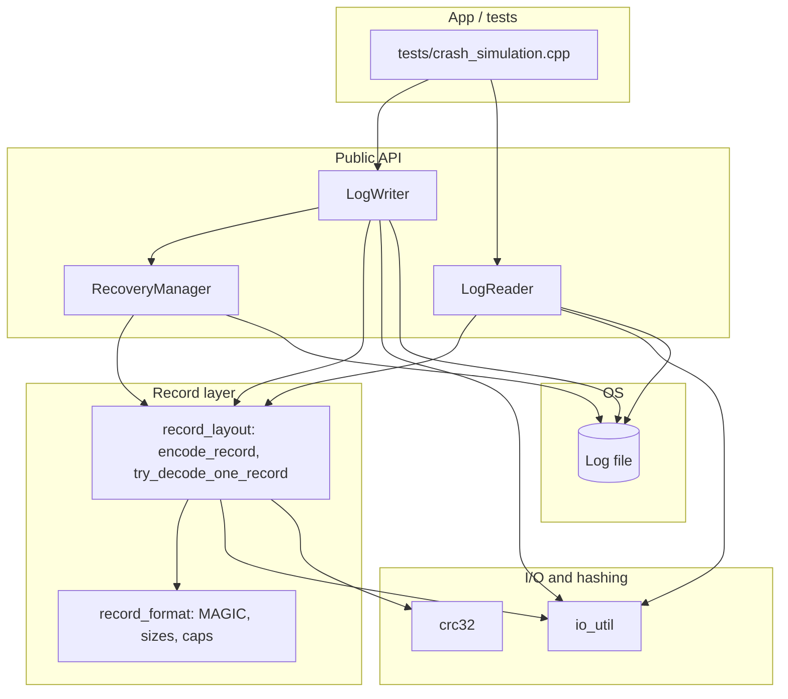
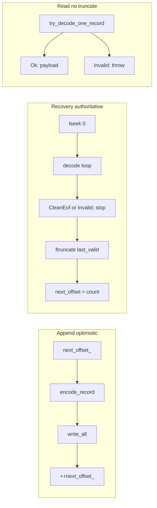
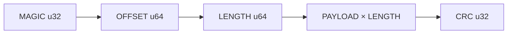
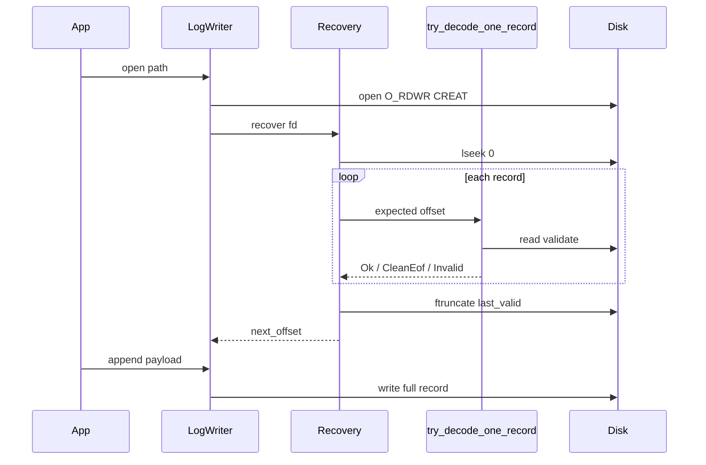

# Architecture (study guide)

Mermaid diagrams below render in GitHub, VS Code Markdown preview, and many other viewers.

## Suggested reading order

1. `include/log_storage/record_format.hpp` — layout, constants, design rationale  
2. `src/record_layout.cpp` — `encode_record` / `try_decode_one_record` (single validation path)  
3. `src/recovery_manager.cpp` — scan, stop at first invalid, `ftruncate`  
4. `src/log_writer.cpp` — open → recover → append  
5. `src/log_reader.cpp` — sequential read, same checks, no truncate  

## Components and dependencies

## Append vs recovery vs read

## On-disk record (strict byte order, little-endian scalars)

## Open writer: recovery always runs first

