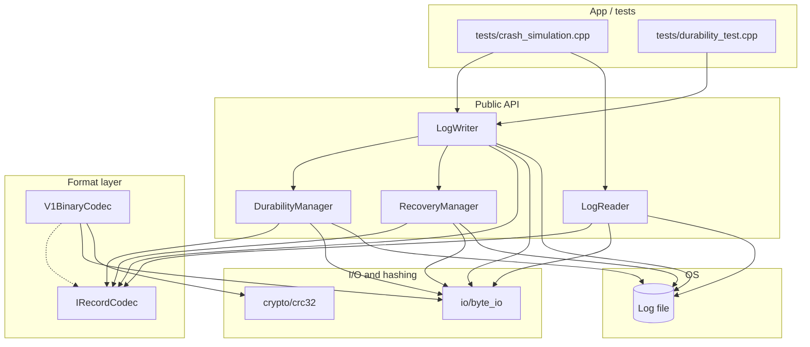
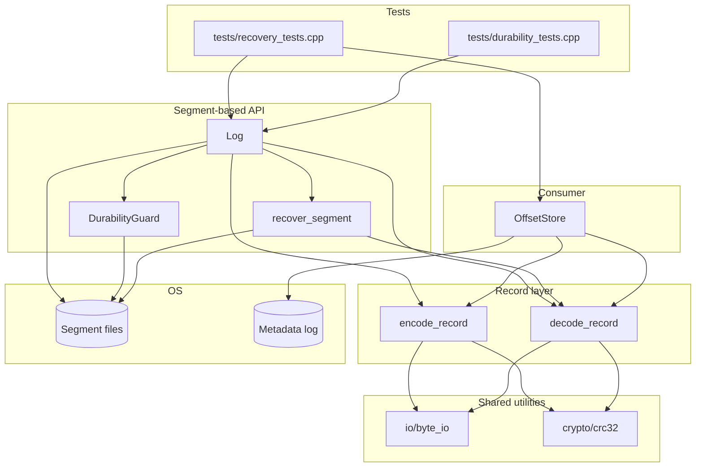
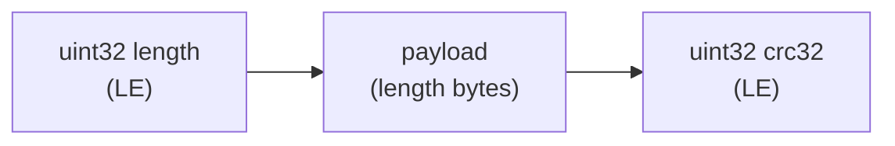
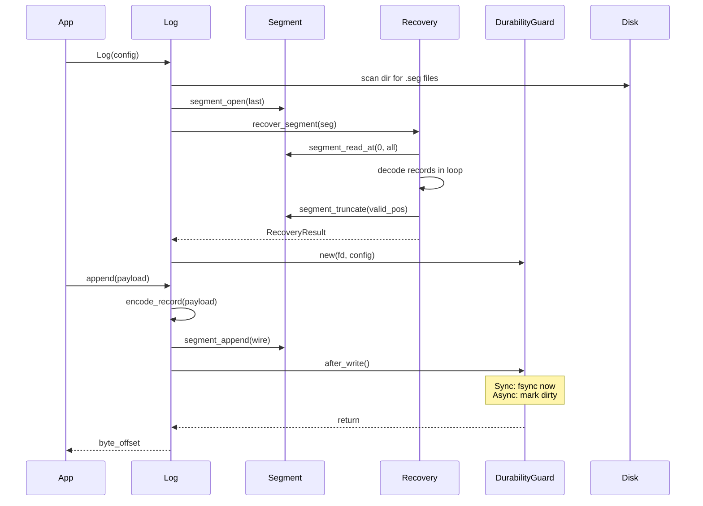
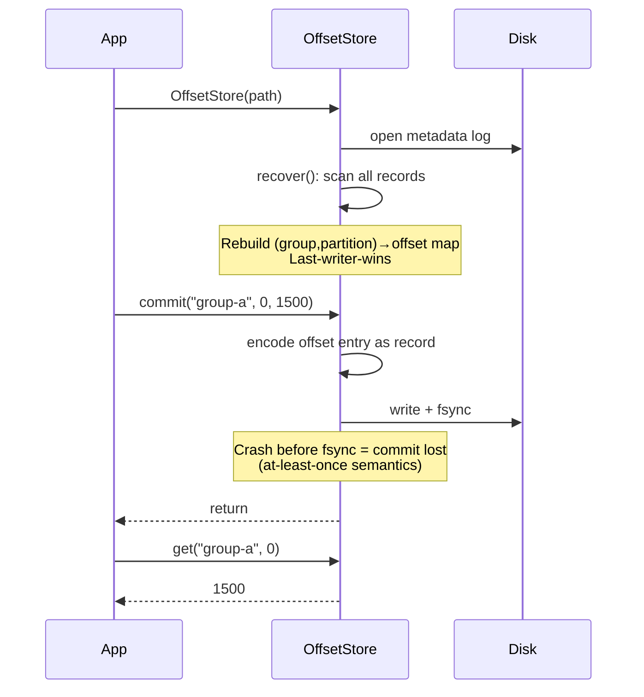
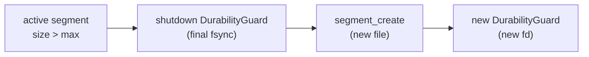

# Architecture (study guide)

Mermaid diagrams below render in GitHub, VS Code Markdown preview, and many other viewers.

## Suggested reading order

### Week 1-2 (single-file log)
1. `include/log_storage/format/irecord_codec.hpp` — pluggable framing contract
2. `include/log_storage/format/v1_constants.hpp` + `format/v1_binary_codec.hpp` — default on-disk layout
3. `src/log_storage/recovery/recovery_manager.cpp` — scan, stop at first invalid, `ftruncate`
4. `src/log_storage/writer/log_writer.cpp` — open → recover → append
5. `src/log_storage/durability/durability_manager.cpp` + `writer/durable_log_writer.cpp` — SYNC/ASYNC

### Week 3-4 (segment-based log)
1. `include/log_storage/storage/record.hpp` — wire format `[length][payload][crc32]`
2. `src/log_storage/storage/segment.cpp` — file-level operations
3. `src/log_storage/storage/recovery.cpp` — scan + truncate (single function)
4. `src/log_storage/storage/durability.cpp` — Sync / Async guard
5. `src/log_storage/storage/log.cpp` — segment management + append/read
6. `src/log_storage/consumer/offset_store.cpp` — `(group, partition) → offset`

## Week 1-2 components

## Week 3-4 components

## Week 3-4 on-disk record format

CRC covers `length_bytes ‖ payload_bytes` — protects both the length value and payload content.

## Segment-based log lifecycle

## Consumer offset store lifecycle

## Segment rolling

Crash between B and C: old segment fsynced, no new file. Safe.
Crash during write to new segment: recovery truncates partial tail. Safe.
